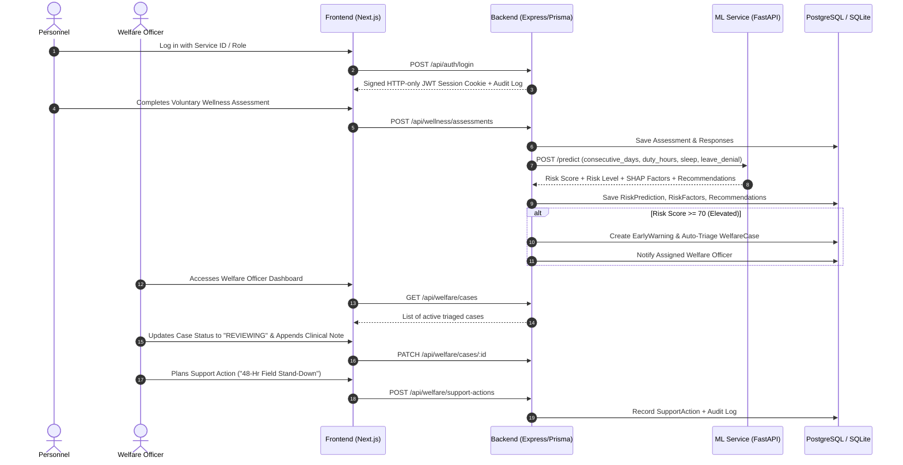

# MISSIONWELL AI — System Architecture & Design

**AI-Based Predictive Personnel Stress and Welfare Monitoring System for Uniformed Forces**  
*Organization: Ministry of Home Affairs | Department: CRPF, Police II Division*

---

## 1. System Philosophy & Non-Negotiable Tenets

1. **Welfare Support, Not Disciplinary System**:
   - Outputs are strictly designated as **"Wellness Risk Indicators"**, never medical diagnoses.
   - The platform is **non-punitive**: no ACR penalty, no adverse career ranking, no disciplinary action triggered.
   - All AI insights are supportive indicators requiring authorized human officer review.

2. **Zero-Trust Privacy & Role Boundaries (DPDP Act 2023)**:
   - **PERSONNEL**: Can view only own profile, voluntary assessment history, and personal recommendations. Forbidden from accessing other personnel's data.
   - **WELFARE_OFFICER**: Assigned case management, intervention planning, and clinical progress notes.
   - **COMMANDER**: Aggregated unit-level operational readiness heatmaps and workload trends. Granular individual survey responses are strictly redacted to protect trust.
   - **ADMIN**: User/unit management, audit trail inspection, system configuration.

---

## 2. Monorepo Directory Organization

```
MW/
├── frontend/                     # Next.js 15+ Web Application
│   ├── app/                      # App Router (login, dashboard, presentation, api)
│   ├── components/               # shadcn/ui, layout, dashboard, charts, forms
│   ├── lib/                      # Auth utilities, mock fallbacks, force metadata
│   ├── services/                 # API service layer (auth, wellness, welfare, risk, notifications)
│   ├── types/                    # TypeScript domain interfaces
│   ├── prisma/                   # Prisma schema & SQLite dev database
│   ├── Dockerfile                # Production Next.js container definition
│   └── package.json
│
├── backend/                      # Node.js & TypeScript REST API Service
│   ├── src/
│   │   ├── controllers/          # Request handling
│   │   ├── services/             # Core business logic (auth, wellness, welfare, reports, audit)
│   │   ├── routes/               # Express modular REST endpoints
│   │   ├── middleware/           # JWT session auth, RBAC authorization, error handling
│   │   ├── lib/                  # Prisma client, JWT, bcryptjs, ML client
│   │   └── server.ts             # Express server entry point (Port 5000)
│   ├── prisma/
│   │   ├── schema.prisma         # SQLite schema for zero-config dev
│   │   ├── schema.postgresql.prisma # PostgreSQL schema for production
│   │   └── seed.ts               # Synthetic demo seeder across all 4 roles
│   ├── Dockerfile
│   └── package.json
│
├── ml-service/                   # Python 3.11+ FastAPI ML & Explainability Microservice
│   ├── models/                   # LightGBM model artifact (defense_stress_lgbm_model.joblib)
│   ├── src/                      # Predictor & SHAP tree explainer engine
│   ├── main.py                   # FastAPI application & REST endpoint (/predict)
│   ├── requirements.txt          # Python dependencies (lightgbm, shap, scikit-learn, etc.)
│   └── Dockerfile
│
├── tests/                        # Automated Verification Suite
│   ├── run-tests.js              # Full integration & RBAC security test runner (16/16 passing)
│   ├── unit/                     # Unit tests
│   └── integration/              # API and database tests
│
├── docs/                         # Project Documentation
│   ├── ARCHITECTURE.md           # This document
│   ├── API_SPECIFICATION.md      # OpenAPI REST specification
│   └── DPDP_COMPLIANCE.md        # Privacy & data protection framework
│
├── docker-compose.yml            # Multi-service orchestrator (postgres, ml-service, backend, frontend)
├── package.json                  # Root runner script
└── README.md                     # Root project overview & startup guide
```

---

## 3. End-to-End Operational Pipeline


